# 🐸 Pepetopia Investor Bot

> **Located at:** `pepetopia-core/investor_bot`
> _Turning complex code into clear updates for the Pepetopia community._


## 👋 Hello! What is this?

Welcome to the **Investor Relations** engine of Pepetopia.

In the chaotic world of Memecoins, silence creates doubt. We believe in radical transparency. This bot is our automated storyteller; it wakes up every evening, checks what our developers have built, and translates those technical details into exciting, easy-to-understand updates for our Telegram community.

**We code, it speaks. You stay informed.** 🚀

---

## ✨ The Magic (How it works)

We don't just dump raw code logs. We use advanced AI to give you the "why" behind the "what".

1.  **🔍 Scout:** The bot scans our `pepetopia-core` repository for the latest commits.
2.  **🧠 Translate:** It sends the technical data to **Google Gemini AI**, which rewrites it from "nerd-speak" to "investor-speak" (in Turkish 🇹🇷).
3.  **📢 Broadcast:** It posts a polished daily report to our private Telegram channel.
4.  **📝 Memory:** It remembers exactly where it left off, so you never miss an update.

### 🤖 Smart Model Selection

The bot automatically discovers all available Gemini models and selects the best one:

- **Dynamic Discovery:** Fetches all models via Google's API using regex-based version parsing
- **Intelligent Sorting:** Prioritizes by version (2.0 > 1.5) and tier (Ultra > Pro > Flash > Nano)
- **Auto-Fallback:** When rate limits hit, seamlessly switches to the next available model
- **Zero Downtime:** Continues operation even when primary models are unavailable

```mermaid
graph LR
    A[📂 Pepetopia Core] -- New Code --> B(🤖 Investor Bot)
    B -- Raw Data --> C{✨ Gemini AI}
    C -- Human Summary --> D[📱 Telegram Channel]
    style B fill:#e1f5fe,stroke:#01579b,stroke-width:2px
    style C fill:#f3e5f5,stroke:#4a148c,stroke-width:2px

```



---

## 🛠️ Installation & Usage

Since this bot lives inside the core repository, here is how you run it specifically.

### 1. Clone & Navigate

First, get the core repository and move into the bot's directory:

```bash
git clone [https://github.com/pepetopia-dev/pepetopia-core.git](https://github.com/pepetopia-dev/pepetopia-core.git)
cd pepetopia-core/investor_bot

```

### 2. Install Dependencies

We keep our requirements lightweight and secure:

```bash
pip install -r requirements.txt

```

### 3. Configure Secrets

Security is our priority. Create a `.env` file inside the `investor_bot` folder. **Do not share this file.**

```ini
TELEGRAM_BOT_TOKEN=your_bot_token
TELEGRAM_CHAT_ID=your_channel_id
GITHUB_ACCESS_TOKEN=your_github_pat
GITHUB_REPO_NAME=pepetopia-dev/pepetopia-core
GEMINI_API_KEY=your_google_ai_key

```

### 4. Run the Bot

Wake it up! The bot is scheduled to send updates daily at **20:00**.

```bash
python main.py

```

---

## 🛡️ Security Note

- **No Hardcoded Secrets:** All API keys are managed via environment variables.
- **Read-Only Access:** The bot only requires `read` permissions for the repository.
- **Clean Logs:** We log operations but never sensitive data.

---

**Built with 💚 for the Pepetopia Community.**
